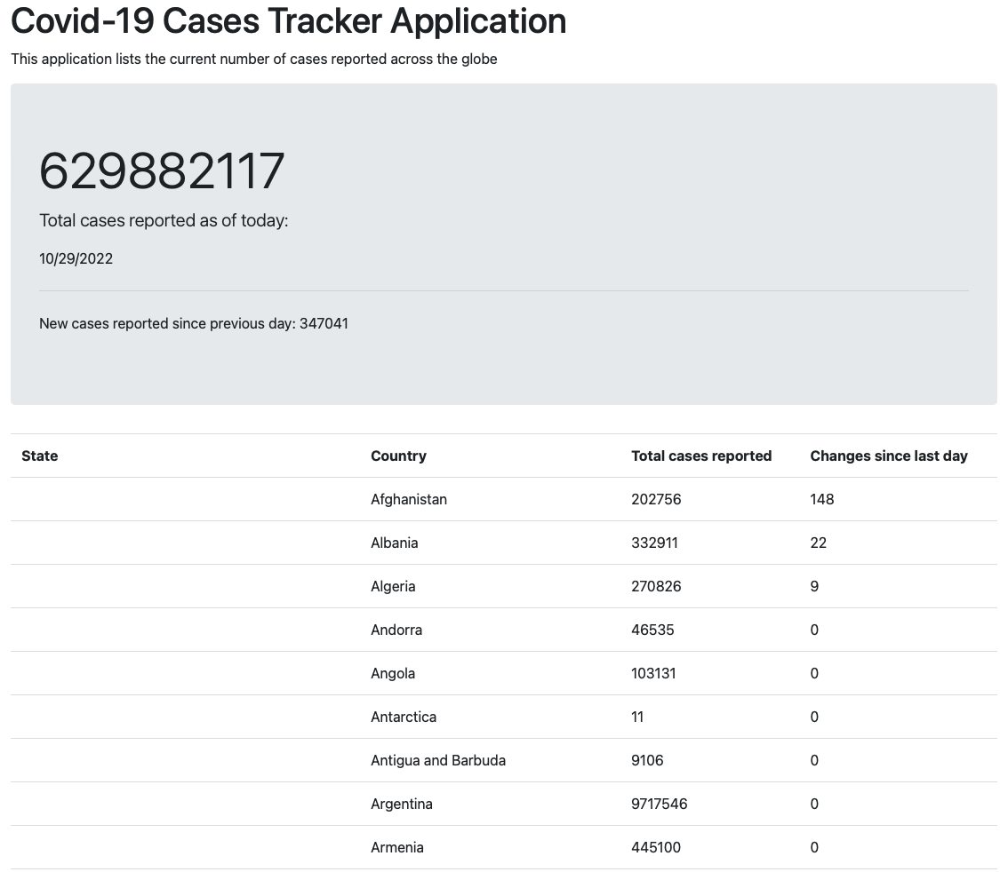

# Project Title:

A COVID-19 Tracker Web Application.

## 1. Project Description: 

A Java Spring Boot Web application for tracking global Corona Virus (COVID-19) cases.

## 2. Tech Stack:

- HTML / Bootstrap
- JavaScript 
- Java 11
- Spring Boot 2.7.5
- Maven
- Intellij IDE

Spring Dependencies:
- Spring Web
- Thymeleaf 
- Spring Boot Dev Tools

## 3. Data source used: 

COVID-19 Data Repository by the Center for Systems Science and Engineering (CSSE) at Johns Hopkins University

https://github.com/CSSEGISandData/COVID-19/tree/master/csse_covid_19_data/csse_covid_19_time_series

## 4. Installation:

i. Clone the git repo

```
https://github.com/AAdewunmi/covid-tracker-application.git
```

ii. Open project folder

iii. Explore

## 5. How To Use:

- Run CovidTrackerApplication.java in Intellij IDE.

- Open http://localhost:8080 in any web browser and view.

## 6. Demo (UI Screenshot):



## 7. Contribution:

Pull requests are welcome. For major changes, please open an issue first to discuss what you would like to change.

## Adapted from:

UDEMY: Java Development Mega Course: Build Projects Practically

(Java Programming Course: Learn Development of JAVA Projects Using JSP, JDBC, Servlets, Swing, Spring Boot, Maven, Hibernate)

Project Name: Project 39: Covid Information Tracker

Created by: Engineering.Org.In

Last updated: 09/2022

URL: https://www.udemy.com/course/build-real-world-java-projects-using-spring-jsp-jdbc/
